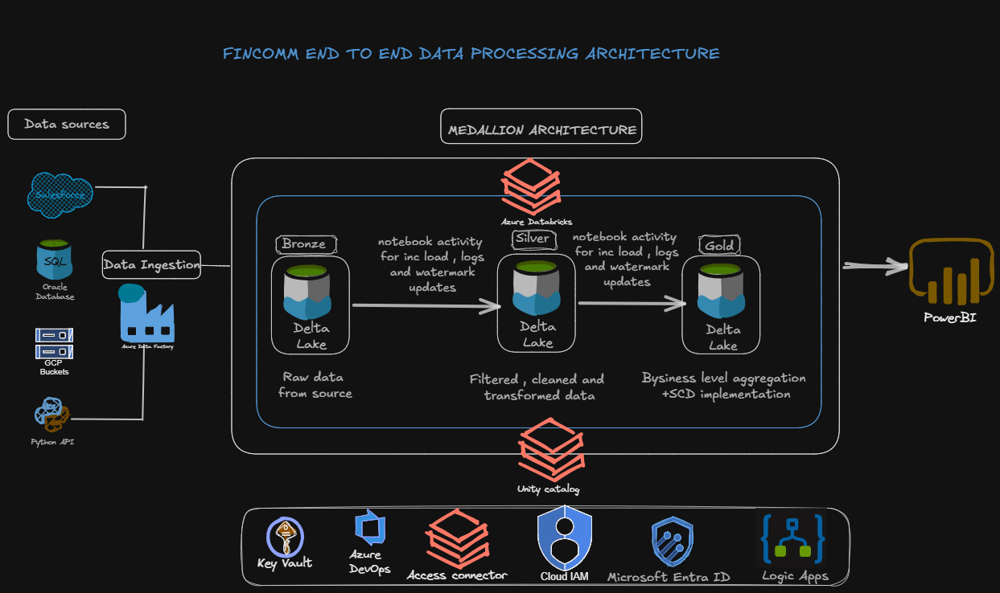
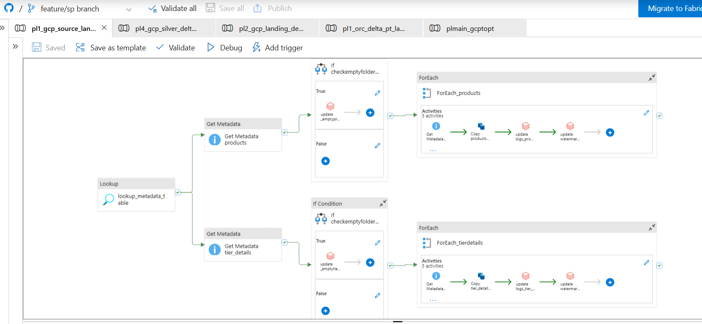
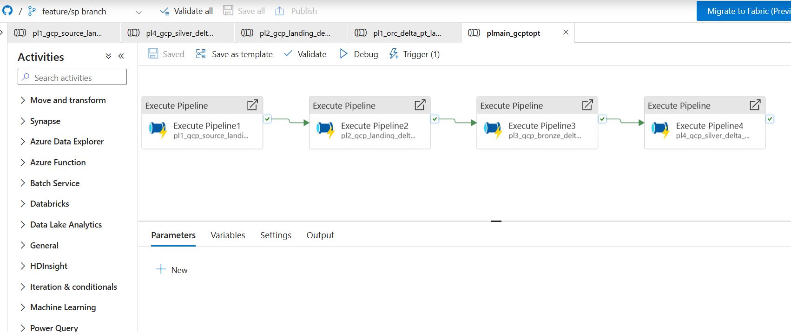
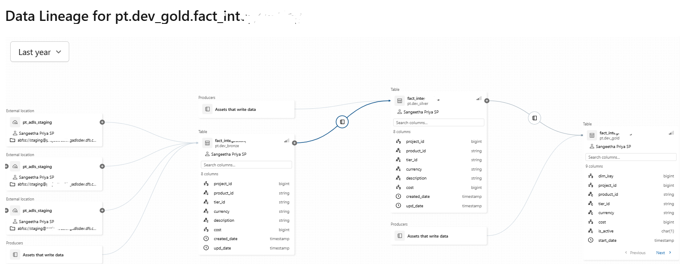

# Financial-Data-Processing-with-Azure-Stack-and-PySpark
## Introduction 
Designed and developed an end-to-end financial data processing pipeline using Azure Data Factory, ADLS Gen2, Azure Databricks, and PySpark. Implemented scalable ETL workflows, data transformation, and reporting solutions for commercial finance and cost analytics using Delta Lake architecture.

## Architecture Diagram

## Technology used
- Azure Data Factory
- ADLS Gen 2
- Azure Databricks
- Azure Key Vault
- Microsoft Entra ID
- Python
- Oracle SQL
- Spark SQL
- Salesforce
- GCP Bucket
- Azure Logic App

## Architecture Overview

This project follows the Medallion Architecture (Bronze–Silver–Gold) approach to process and analyze financial data from multiple enterprise source systems for downstream analytics and business applications.

Source Systems (Oracle | GCP Bucket | Salesforce)
↓
Bronze Layer (ADLS Gen2 – Raw Data)
↓
Silver Layer (Delta Tables – Cleansed & Standardized Data)
↓
Gold Layer (Business-Curated Delta Tables)
↓
Downstream Applications & Analytics

## Data Pipeline Workflow
### 1 Multi-Source Data Ingestion

Financial and operational data is ingested from multiple enterprise systems including:

- Oracle Database
- GCP-based source systems
- Salesforce

Data from different platforms is integrated into a centralized Azure-based data platform for unified processing and analytics.

### 2️ Bronze Layer – Raw Data Ingestion
- Azure Data Factory / Azure Databricks pipelines ingest raw data into ADLS Gen2 Bronze Layer
- Metadata-driven and dynamic pipelines used for scalable ingestion
- Azure Key Vault integrated for secure credential and secret management
- Raw data stored in its original format for audit and traceability

### 3️ Silver Layer – Data Transformation & Standardization

PySpark and Spark SQL transformations process Bronze data to:

- Perform data cleansing and standardization
- Handle schema transformations
- Apply business validation rules
- Implement Slowly Changing Dimension (SCD Type 2) logic for historical data tracking
- Store transformed data as optimized Delta Tables

### 4 Unity Catalog used for centralized governance and data access management.

### 5 Gold Layer – Business-Curated Data
- Business-ready datasets created using PySpark and Spark SQL
- Aggregated and curated financial data prepared for downstream consumption
- Data quality and optimized Delta processing improve analytics performance
- Gold layer data shared with downstream applications and reporting systems

### 6 Operational Workflow & Notifications
- Azure Logic Apps integrated for workflow automation and operational monitoring
- Pipeline execution status and alerts automatically triggered
- Success and failure notifications sent to support operational reliability

### 7 Orchestration & Version Control
- End-to-end automated pipeline orchestration implemented
- Error handling and monitoring included for reliable execution
- GitHub used for version control and collaborative code management
- Changes pushed and maintained through Git-integrated development workflow

## Outcome
- Centralized financial data platform built using Medallion Architecture
- Unified data ingestion from multiple enterprise systems
- Improved data governance using Unity Catalog
- Historical data tracking enabled through SCD Type 2 implementation
- Faster downstream analytics using Delta Lake optimization
- Automated monitoring and workflow notifications for operational efficiency

## Future Enhancements
- CI/CD implementation using Azure DevOps
- Advanced data quality validation frameworks
- Real-time streaming ingestion using Kafka/Event Hub
